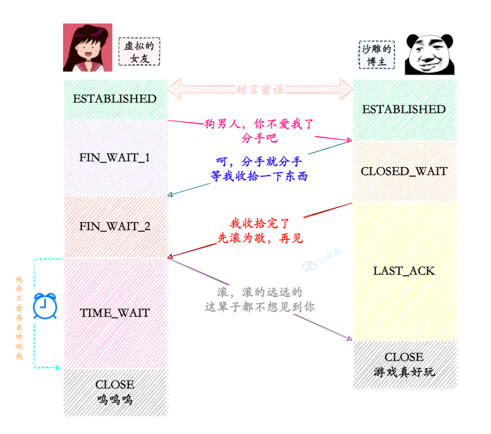

> 合抱之木，生于毫末；九层之台，起于累土；千里之行，始于足下。

[TOC]

### 面经

#### 1. 讲一下tcp四次挥手以及此时客户端和服务器的状态

1. 客户端发送 FIN

   客户端由ESTABLISHED *[established adj.确立已久的 ]* 变为 FIN_WAIT_1

2. 服务器返回 ACK

   服务器收到FIN后变为 CLOSED_WAIT 状态，并发送一个ACK给客户端，客户端收到后进入FIN_WAIT_2

3. 服务器发送 FIN

   服务器将数据发送完毕时发送FIN，并且进入 LAST_ACK 状态

4. 客户端返回 ACK

   客户端收到FIN后发送ACK并且进入TIME_WAIT 状态，等2MSL进入CLOSE 状态

   服务器收到ACK直接 CLOSE



#### 2. 上述tcp四次挥手过程中为什么要等待2MSL才CLOSE？能是其它时间吗？

* 保证客户端发送的ACK报文能到达服务端，在2MSL时间内未到达可重传（超时+1MSL传送）
* 防止已经失效的连接请求出现在本连接中，2MSL本次所有报文都会超时失效，不会影响到下一次连接
* MSL（Maximum Segment Lifetime），报文最大生存时间，超过这个时间的报文会被丢弃，2MSL为发送报文和收到ACK一个来回的最大时间

#### 3. Mysql事务了解吗？有哪些特性

* ACID，原子性（Atomicity）、⼀致性（Consistency）、隔离性（Isolation）、持久性（Durability）
* 原子性：事务是一个不可分割的单位，要么都做，要么都不做
* 隔离性：各个事务之间不能互相干扰
* 持久性：事务一旦提交就永久改变在磁盘上
* 一致性：数据处于一种语义上的有意义且正确的状态。 一致性是对数据可见性的约束，保证在一个事务中的多次操作的数据中间状态对其他事务不可见的。

#### 4. 了解类加载机制吗？

1. 加载Loading

   通过类的全限定名来获取类的二进制字节流，在内存中生成一个代表该类的java.lang.Class对象

2. 连接Linking

   1. 验证Verification

      判断class字节流是否符合，文件格式，元数据语义校验，字节码验证，符号引用验证

   2. 准备Preparation

      为类中静态变量分配内存并设置类变量初始值

   3. 解析Resolution

      将常量池符号引用替换为直接引用

3. 初始化Initialization

   根据程序编码制定初始化类变量和其他资源。通俗是执行类构造器的方法

4. 使用Using

5. 卸载Unloading

#### 5. java如何实现线程安全

* 阻塞同步，使用Lock或者Synchronized
  * 频繁的线程阻塞，唤醒操作，用户态内核态切换带来的性能问题
* 非阻塞同步，CAS
  * 为获取同步资源的线程不断自旋
  * 仅适合单个资源，组合类型仍需加锁
  * ABA，版本号
* 无同步方案，线程的本地存储，ThreadLocate
  * 对一个共享资源尽可能的在同一个线程中执行
  * web服务中一个请求对应一个服务线程（生产-消费）

### 算法

#### 1. 回溯-中-组合

[77. 组合 - 力扣（LeetCode）](https://leetcode.cn/problems/combinations/)

* n个数，选k个作为组合，且不能重复
* 添加或者不添加构成回溯
* 两个List一个存放当前路径，一个存放成功的路径

```java
class Solution {
    List<List<Integer>> res = new ArrayList<>();
    LinkedList<Integer> path = new LinkedList<>();
    public List<List<Integer>> combine(int n, int k) {
        helper(n, k, 1);
        return res;
    }
    public void helper(int n,int k,int startIndex){
        if(path.size()==k){ // 达到k
            res.add(new ArrayList<>(path));
            return;
        }
        for(int i= startIndex;i <= n - (k - path.size()) + 1;i++){
            path.add(i);
            helper(n, k, i+1); // 回溯
            path.removeLast();
        }
    }
}
```

#### 2. 回溯-中-组合总数III

[216. 组合总和 III - 力扣（LeetCode）](https://leetcode.cn/problems/combination-sum-iii/)

* 找到相加之和为n的k个数的组合，只能使用1-9且每个数字最多使用1次
* 同上，但是有总数和的限制
* 可以每次选择当前值后从当前值之后寻找就不会有重复了

```java
class Solution {
    List<List<Integer>> res = new ArrayList<>();
    LinkedList<Integer> path = new LinkedList<>();
    public List<List<Integer>> combinationSum3(int k, int n) {
        helper(k, n, 1, 0);
        return res;
    }
    public void helper(int k, int n,int first,int sum){
        if(path.size()==k&&sum==n){ // 条件
            res.add(new ArrayList<Integer>(path));
        }
        for(int i=first;i<=9;i++){
            if(i+sum>=n&&path.size()+1<k)return;
            path.add(i); 
            helper(k, n, i+1, sum+i); // 回溯
            path.removeLast();
        }
    }
}
```

#### 3. 回溯-中-组合总数

[39. 组合总和 - 力扣（LeetCode）](https://leetcode.cn/problems/combination-sum/)

* 同上，但同一个数字可以被无限制选取
* 同上，但没有个数和重复数字的限制，且只能在某个数组里选择
* 同上

```java
class Solution {
    List<List<Integer>> res = new ArrayList<>();
    List<Integer> path = new ArrayList<>();
    public List<List<Integer>> combinationSum(int[] candidates, int target) {
        traceBack(candidates, target,0,0);
        return res;
    }
    private void traceBack(int[] candidates,int target,int sum,int index){
        if(sum==target){
            res.add(new ArrayList<>(path));
        }
        for(int i=index;i<candidates.length;i++){
            if(sum+candidates[i]>target)continue; // 跳出
            path.add(candidates[i]);
            traceBack(candidates, target,sum+candidates[i],i); // 回溯
            path.remove(path.size()-1);
        }
    }
}
```

### 其它

#### 1. 了解快排吗？如何实现？

* 属于交换和比较排序，通过元素之间的比较和交换位置来达到排序的目的。
* 不稳定排序，从前往后找大，从后往前找小，遇到相同值原先排列顺序会打乱
* $O(nlogn)$
* 分治

```java
public void quickSort(int[] arr,int begin,int end){
    if(begin>=end)return;
    int l = begin;
    int r = end;
    int tmp = arr[begin];// 基准值
    while (l<r){
        while (l<r&&arr[r]>tmp)r--; // 从右往前找小于基准值
        if(l<r) arr[l++]=arr[r];
        while (l<r&&arr[l]<tmp)l++; // 从左往右找大于基准值
        if(l<r) arr[r--]=arr[l];
    }
    arr[l]=tmp; // 基准值赋值中间位置，左侧小 右侧大，基准值到拍好序的位置
    quickSort(arr,begin,l-1); // 左方快排
    quickSort(arr,l+1,end);  // 右方快排
}
```

#### 2. 如何设计一个排行榜系统，用户可以查看自己的排名

* Mysql
  * 整体排序 ORDER BY score，
    * 简单，成本低但耗时
    * 优化：加索引并限制排序数据量
  * 用户排名，找到自己的分数，在统计大于自己分数的数量即为自己的排名
  * TopN
    * 全局排序，占内存
    * 维护N大小的容器，省空间，但每次找最小值，交换费时
    * N大小的小根堆，后续值如果大于堆顶元素则调整
    * 分表情况下，分治，每个表找到topN再合并到一起寻找
* Redis，有序集合ZSet
  * ZRANGE
  * ZSCORE
  * ZREVRANK
