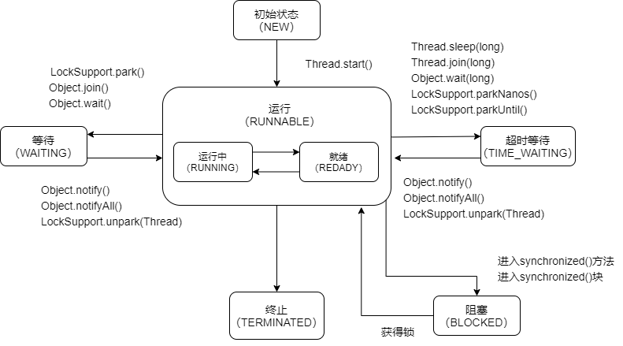

> 博学之，审问之，慎思之，明辨之，笃行之。

[toc]

### 面经

#### 1. String、StringBuffer、StringBuilder 的区别？

* 可变性：String不可变，可以理解为常量，线程安全，其它可变

* 线程安全性：StringBuffer相比于StringBuilder添加锁，StringBuilder线程不安全。

* 性能：`StringBuilder`>`StringBuffer`>``String`。StringBuilder性能更高，但线程不安全。

* ```java
  public final class String
      implements java.io.Serializable, Comparable<String>, CharSequence {
      private final char value[]; // 1.8char; 1.9+byte减少空间
      ...
      public String concat(String str) {
          int otherLen = str.length();
          if (otherLen == 0) {
              return this;
          }
          int len = value.length;
          char buf[] = Arrays.copyOf(value, len + otherLen);
          str.getChars(buf, len);
          return new String(buf, true); // 返回新的对象
      }
      ...
  }
  ```

  ```java
  public final class StringBuilder
      extends AbstractStringBuilder
      implements Serializable, CharSequence
  {
      @Override
      public StringBuilder append(String str) {
          super.append(str);
          return this; // 本身
      }
  }
  ```

  ```java
   public final class StringBuffer
      extends AbstractStringBuilder
      implements Serializable, CharSequence
  {
      @Override
      public synchronized StringBuffer append(String str) {
          toStringCache = null;
          super.append(str);
          return this; // 本身
      }
  }
  ```

#### 2. String s1 = new String("abc"); 这句话创建了几个字符串对象？

* 一个或者两个

* String s = "abc"

  1. 栈中创建对象的引用s
  2. 如果String常量池没有"abc"则在池中创建
  3. 将abc地址赋给s

* String s1 = new String("abc"); 相当于 String s1 = new String(s);

  1. 创建引用s2
  2. 如果string常量池中没有"abc"(s)则创建
  3. 在堆中新建"abc"String对象
  4. 将创建的对象赋给s1

* 既然已经在string常量池中创建了对象，那么intern还有什么作用的呢？

  new String(char value[])，并不会在常量池中生成

#### 3. 你了解Java的异常处理机制吗？详细说说

* Throwable、Exception、Error

  * Throwable是所有异常的父类
  * Exception程序本身可以处理的异常
  * Error 程序无法处理，通常为运行环境出错，OOM
* 受检异常，不受检异常

  * 受检异常必须catch或者throws
  * 不受检异常通常为程序内部

#### 4. 了解java线程的状态和转化过程吗？

| 状态         |                              |
| ------------ | ---------------------------- |
| NEW          | 初始状态，未start()          |
| RUNNABLE     | 运行，包括就绪和运行         |
| BLOCKED      | 阻塞                         |
| WAITING      | 等待                         |
| TIME_WAITING | 超时等待，指定的时间自行返回 |
| TERMINATED   | 终止状态                     |



#### 5. java中创建线程有多少种方式？

*很基础的东西，一定要知道，我的第一场面试，水滴一面问到了，那时候毫无准备，问了不会面试官就很败兴，“春招才刚开始，你要学习的还有很多”*

* 继承Thread

  ```java
  public class MyThread extends Thread{
      @Override
      public void run() {
          // 方法
          System.out.println(Thread.currentThread().getName());
      }
  }
  //////////
  public class Test {
      public static void main(String[] args) {
          MyThread thread = new MyThread();
          // 相当于调用run方法，仍在主线程
          thread.run();
          // 开启一个线程
          thread.start();
      }
  }
  ///////////
  main
  Thread-0
  ```

* 实现Runnable

  ```java
  public class MyRunnable2 implements Runnable{
      @Override
      public void run() {
          System.out.println(Thread.currentThread().getName());
      }
  }
  //////////
  public class Test {
      public static void main(String[] args) {
          // 调用runnable
          Thread thread = new Thread(new MyRunnable2());
          thread.start();
          // lambda表达式
          new Thread(()->{
              System.out.println(Thread.currentThread().getName());
          }).start();
      }
  }
  /////////
  Thread-0
  Thread-1
  ```

* 使用Callable和Future

  ```java
  public class MyCallable implements Callable<Integer> {
      @Override
      public Integer call() throws Exception {
          return 520;
      }
  }
  ////////
  public class Test {
      public static void main(String[] args) {
          // callable 可以有返回值，future处理返回结果
          FutureTask<Integer> futureTask = new FutureTask<>(new MyCallable());
          FutureTask<Integer> futureTask2 = new FutureTask<>(()->{
              return 521;
          });
          new Thread(futureTask).start();
          new Thread(futureTask2).start();
  
          try {
              System.out.println(futureTask.get());
              System.out.println(futureTask2.get());
          } catch (InterruptedException e) {
              throw new RuntimeException(e);
          } catch (ExecutionException e) {
              throw new RuntimeException(e);
          }
      }
  }
  /////////
  520
  521
  ```

* 线程池

  ```java
  public class Test {
      public static void main(String[] args) {
          // 线程池有4种常用的实现，但是一般要自定义实现，此处为简陋的演示
          // 需要掌握自定义线程池和线程池的执行流程
          ExecutorService pool = Executors.newFixedThreadPool(3);
          for (int i = 0; i < 10; i++) {
              int ii = i;
              pool.execute(()->{
                  System.out.println(Thread.currentThread().getName()+"  ::  "+ ii);
              });
          }
          pool.shutdown();
      }
  }
  ```

### 算法

#### 1. 数组-重-二分查找

[704. 二分查找 - 力扣（LeetCode）](https://leetcode.cn/problems/binary-search/)

* *不要小看了二分查找，也有很多细节，不关注的话很容易出错。*
* *快手面试的时候遇到了，不过是原先题目排序后查找写完了，让你用二分再优化一下，然后一些细节他问了没答上来，答错了。*
* 关键点，如果是用 < 那么right = arr.length，因为小于的话是不包含末位的，这个时候更新的时候 left = mid+1,right = mid;。如果是 <= ，那么right = arr.length-1, 更新时，left = mid+1,right = mid-1;

```java
class Solution {
    public int search(int[] nums, int target) {
        // <
        int l=0;int r=nums.length;
        while(l<r){
           int mid = l+(r-l)/2;
           if(nums[mid]==target){
               return mid;
           }else if(nums[mid]<target){
               l = mid+1;
           }else{
               r = mid;
           }
        }
        return -1;
    }
}

class Solution {
    public int search(int[] nums, int target) {
        int left = 0;
        // <=
        int right = nums.length-1;
        while(left<=right){
            int mid = (left+right)/2;
            if(nums[mid]==target) return mid;
            else if(nums[mid]<target){
                left = mid+1;
            }else{
                right = mid-1;
            }
        }
        return -1;
    }
}
```

#### 2. 数组-简-移除元素

[27. 移除元素 - 力扣（LeetCode）](https://leetcode.cn/problems/remove-element/)

* 简单的题，主要看你会不会双指针了
* i指向当前值，j移除后的值，分别往后移
* 当遇到目标值的时候，i继续走，j不变，就把要移除的元素的位置空出来了遇到非目标值的时候再放到j上

```java
class Solution {
    public int removeElement(int[] nums, int val) {
        int len = 0;
        for(int i = 0; i<nums.length; i++){
            if(nums[i]!=val){
                nums[len++]=nums[i];
            }
        }
        return len;
    }
}
```

#### 3. 数组-简-有序数组的平方

[977. 有序数组的平方 - 力扣（LeetCode）](https://leetcode.cn/problems/squares-of-a-sorted-array/)

* 本来一个有负数的有序数组，求它平方后的有序数组。
* 很容易想到，负数和正数分成两个部分，类似于归并的操作合成一个有序的数组
* 我从中间往两边分的，弄复杂了，完全可以从两边往中间。

```java
class Solution {
    public int[] sortedSquares(int[] nums) {
        int[] arr = new int[nums.length];
        int left = -1;
        while(left+1<nums.length&&nums[left+1]<0)left++; // 找到正负交界
        int right = left+1;
        int i = 0;
        while(left>-1&&right<nums.length){ // 两边找
            arr[i++]=nums[left]*nums[left]<nums[right]*nums[right]?
                nums[left]*nums[left--]:nums[right]*nums[right++];
            // System.out.println(arr[i-1]);
        }
        while(left>-1){ // 右侧用完了左侧找
            arr[i++]=nums[left]*nums[left--];
        }
        while(right<nums.length){ // z
            arr[i++]=nums[right]*nums[right++];
        }
        return arr;
    }
}
```


### 其它

#### 1. 多线程交替打印？

*用友面试的时候遇到了，那时也没做专项的训练，凭感觉用synchronized实现了，然后又要用lock实现一下，忘了怎么notify了，在锁上 lock.wait()，被面试官狠狠的嘲笑了   /_ \\*

1. 两个线程交替打印 0~100 的奇偶数
2. 三个线程分别打印 A，B，C，要求这三个线程一起运行，打印 n 次，输出形如“ABCABCABC....”的字符串
3. 多线程按顺序调用，A->B->C，AA 打印 5 次，BB 打印10 次，CC 打印 15 次，重复 10 次
4. 参见 [面试官：请用五种方法实现多线程交替打印问题 - 知乎 (zhihu.com)](https://zhuanlan.zhihu.com/p/370130458)

##### **wait&notify**

```java
public class WaitNotifyAbc {
    private int num = 0;
    private int times = 0;
    public static final Object lock = new Object();
    public WaitNotifyAbc(int times){
        this.times=times;
    }
    public void printAbc(int targetNum) {
        for(int i=0;i<times;i++){
            synchronized (lock) { // 锁
                while (num % 3 != targetNum) {
                    try {
                        lock.wait(); // wait
                    } catch (InterruptedException e) {
                        throw new RuntimeException(e);
                    }
                }
                num++;
                System.out.print(Thread.currentThread().getName());
                lock.notifyAll(); // notify
            }
        }
    }
    public static void main(String[] args) {
        WaitNotifyAbc abc = new WaitNotifyAbc(10);
        new Thread(() -> {
            abc.printAbc(0);
        }, "A").start();
        new Thread(() -> {
            abc.printAbc(1);
        }, "B").start();
        new Thread(() -> {
            abc.printAbc(2);
        }, "C").start();
    }
}
```

##### lock

```java
public class LockAbc {
    public volatile int num = 0;
    public static final ReentrantLock lock = new ReentrantLock();
    public final int times;
    public LockAbc(int times) {
        this.times = times;
    }
    public void printAbc(int target){
        for(int i=0;i<times;){
            lock.lock();
            if(num%3==target){
                i++;
                num++;
                System.out.print(Thread.currentThread().getName());
            }
            lock.unlock();
        }
    }
}
```

##### lock&Condition

```java
public class LockConditionAbc {
    private final int times;
    private volatile int num;
    private ReentrantLock lock = new ReentrantLock();
    private final Condition c1 = lock.newCondition();
    private final Condition c2 = lock.newCondition();
    private final Condition c3 = lock.newCondition();

    public LockConditionAbc(int times) {
        this.times = times;
    }
    public void printAbc(int targetNum,Condition current,Condition next){
        for(int i=0;i<times;i++){
            lock.lock();
            try {
                while (num%3!=targetNum)current.await();
                num++;
                System.out.print(Thread.currentThread().getName());
                next.signal();
            } catch (InterruptedException e) {
                throw new RuntimeException(e);
            }finally {
                lock.unlock();
            }
        }
    }
    public static void main(String[] args) {
//        WaitNotifyAbc abc = new WaitNotifyAbc(10);
        LockConditionAbc abc = new LockConditionAbc(10);
        new Thread(() -> {
            abc.printAbc(0, abc.c1, abc.c2 );
        }, "A").start();
        new Thread(() -> {
            abc.printAbc(1, abc.c2, abc.c3);
        }, "B").start();
        new Thread(() -> {
            abc.printAbc(2, abc.c3, abc.c1 );
        }, "C").start();
    }
}
```

##### Semphore

```java
public class SemaphoreAbc {
    private final int times;
    private Semaphore semaphoreA = new Semaphore(1);
    private Semaphore semaphoreB = new Semaphore(0);
    private Semaphore semaphoreC = new Semaphore(0);

    public SemaphoreAbc(int times) {
        this.times = times;
    }
    public void printAbc(Semaphore current,Semaphore next){
        for(int i=0;i<times;i++){
            try {
                current.acquire();
                System.out.print(Thread.currentThread().getName());
                next.release();
            } catch (InterruptedException e) {
                throw new RuntimeException(e);
            }
        }
    }
    public static void main(String[] args) {

        SemaphoreAbc abc = new SemaphoreAbc(10);
        new Thread(() -> {
            abc.printAbc(abc.semaphoreA, abc.semaphoreB );
        }, "A").start();
        new Thread(() -> {
            abc.printAbc(abc.semaphoreB, abc.semaphoreC);
        }, "B").start();
        new Thread(() -> {
            abc.printAbc(abc.semaphoreC,abc.semaphoreA );
        }, "C").start();
    }
}
```
